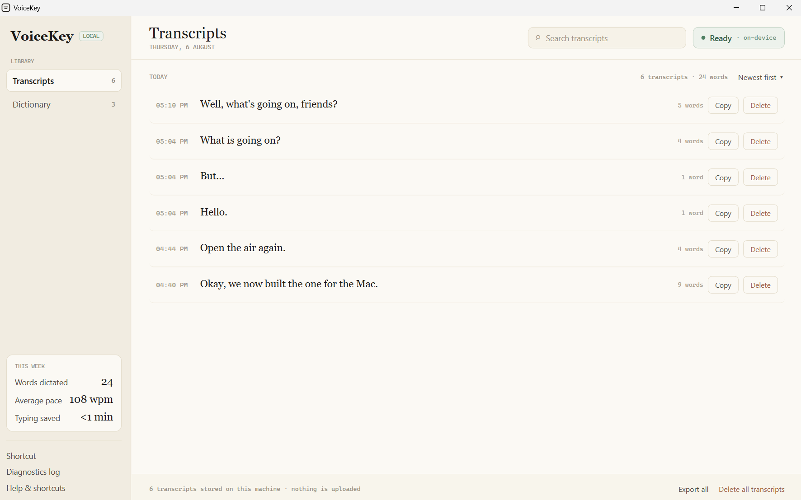

# VoiceKey

Minimal local dictation for macOS and Windows. **Hold the shortcut, speak, release** — the text is typed at the cursor of whatever app has focus. Nothing is uploaded; transcription runs entirely on your machine.



## What it does

- **Hold to talk** — hold the shortcut, speak, release, and the transcript lands at your cursor.
- **Tap to toggle** — a quick tap starts recording; tap again to stop, or just stop talking and it ends itself.
- **Or nothing but the shortcut** — turn `Stop on silence` off and a pause means nothing; the next press ends it.
- **Fully on-device** — Whisper runs locally. No account, no network, no telemetry.
- **Custom dictionary** — teach it your names and jargon; it biases recognition *and* rewrites the finished text.
- **Per-app formatting** — skips the trailing period in editors, ensures one in mail clients.
- **Cleans as it goes** — drops filler words, collapses stutters, discards silence and background noise.
- **Searchable history** — everything you have dictated, grouped by day, with word counts and pace.
- **Says when it is listening** — two short notes, one up to start and one down to stop. Off in a click.
- **Starts when you sign in** — optional, and read live from the system rather than remembered.
- **Updates itself** — checks GitHub at launch; one click downloads the new release and swaps it in.
- **Lives out of the way** — the macOS menu bar and the Windows tray; no Dock or taskbar clutter.

Everything adjustable is behind the gear at the bottom of the sidebar: the shortcut, the sounds, what ends a recording, starting at login, the diagnostics log, and the update check.

## Platforms

| | [macOS](macos/) | [Windows](windows/) |
|---|---|---|
| Built with | Swift + AppKit (SwiftPM) | C# + WPF (.NET 9) |
| Shortcut | ⌃⌥D | Ctrl+Alt+D |
| Engine | [WhisperKit](https://github.com/argmaxinc/WhisperKit) — CoreML on the Neural Engine | [Whisper.net](https://github.com/sandrohanea/whisper.net) — whisper.cpp on CUDA/Vulkan/CPU |
| Model | `openai_whisper-small.en` | `ggml-small.en` |
| Needs | Apple Silicon, macOS 14+ | Windows 10 1809+ x64, .NET 9 |

## Install

**[Download the latest release](https://github.com/TimBreaksStuff/VoiceKeyApp/releases/latest)** — `VoiceKey-<version>-macos-arm64.zip` (Apple Silicon) or `VoiceKey-<version>-win-x64.zip`. Or build from source below. Once it is installed, VoiceKey offers later versions itself.

**macOS** — unzip, move `VoiceKey.app` into `/Applications`, then clear the download quarantine:

```sh
xattr -dr com.apple.quarantine /Applications/VoiceKey.app
```

The app is signed with a self-signed certificate rather than an Apple Developer ID, so Gatekeeper blocks it until that attribute is gone. On first launch grant **Microphone** and **Accessibility**; the model (~220 MB) downloads once.

**Windows** — unzip anywhere and run `VoiceKey.exe`. Self-contained: no .NET install needed. SmartScreen warns because the build is unsigned — *More info → Run anyway*. The model (~470 MB) downloads once.

## Build from source

### macOS

Needs Apple Silicon, macOS 14+, and the Command Line Tools (`xcode-select --install`). Xcode itself is not required.

```sh
git clone https://github.com/TimBreaksStuff/VoiceKeyApp.git
cd VoiceKeyApp/macos
./build.sh --run
```

This builds `build/VoiceKey.app` and launches it. On first run, grant **Microphone** and **Accessibility** under System Settings → Privacy & Security — Accessibility is what lets VoiceKey type at your cursor; without it, transcripts fall back to the clipboard. The model (~220 MB) downloads once into `~/Library/Application Support/VoiceKey/`.

> If you plan to rebuild often, create a self-signed code-signing certificate named **`VoiceKey Dev`** in Keychain Access first. `build.sh` will use it, giving the app a stable identity so the Accessibility grant survives rebuilds. Without it the build is ad-hoc signed and macOS revokes the grant every time.

### Windows

Needs Windows 10 1809+ (x64) and the .NET 9 SDK.

```powershell
winget install Microsoft.DotNet.SDK.9
git clone https://github.com/TimBreaksStuff/VoiceKeyApp.git
cd VoiceKeyApp\windows
.\build.ps1 -Run
```

This publishes a self-contained build into `publish\` and launches it to the tray. The model (~470 MB) downloads once into `%LOCALAPPDATA%\VoiceKey\models`. No accessibility grant is needed, but check **Settings → Privacy & security → Microphone → Let desktop apps access your microphone** is on. An NVIDIA or Vulkan-capable GPU is used when present; otherwise it runs on the CPU.

More detail and gotchas: [windows/README.md](windows/README.md).

## Layout

```
macos/     Swift app — Sources/VoiceKeyCore (pure logic) + Sources/VoiceKey (AppKit)
windows/   .NET app  — VoiceKey.Core (pure logic) + VoiceKey.App (WPF)
plans/     design notes and port plans
```

The two cores are deliberately duplicated rather than shared: no runtime spans Swift-on-Apple-Silicon and .NET-on-Windows without dragging an FFI boundary through the one part of the app that is pure, fast and fully tested. What keeps them honest is that the *tests* were ported first — the xUnit suite asserts the same behaviours, case for case, as the swift-testing one.

## License

MIT
